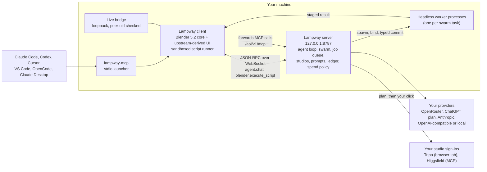

<!-- SPDX-FileCopyrightText: 2026 Lampway contributors -->
<!-- SPDX-License-Identifier: GPL-3.0-or-later -->
<p align="center"></p>

# Lampway

**Your AI. Your subscriptions. Your tools. In the viewport.**

Lampway is an open-source 3D suite on a Blender 5.2 core, with an AI agent inside it and a server **you run yourself**. It does the job a hosted 3D-AI service would do, on the accounts you already pay for, on your machine, and it asks before it spends.

Lampway is an independent open-source project, started from the GPL-licensed Mixar client and built on Blender. Not affiliated with or endorsed by Mixar, Adeveda Enterprises Private Limited or the Blender Foundation. The upstream backend is closed and hosted, so the backend here is new: single-user and loopback by default. See [Attribution](#licence-and-attribution).

> **Status: early, built in the open, one branch per wave.** Linux is the platform that has been built and run. There are no binaries yet; you build from source. Everything in [Features](#features-as-built) says how far it got and links the report that measured it.

---

## Why

A 3D tool should not be a meter.

Most AI 3D products rent you a hosted model and a credit counter. Lampway is built on the opposite rule set:

- **Your inference.** The agent runs on a model you choose and pay for: an API key, an OpenAI-compatible server on your own hardware, OpenRouter with a hard session ceiling, or your ChatGPT plan through OpenAI's own "Sign in with ChatGPT" flow.
- **Your studios.** Generation services (Tripo, Higgsfield) are used through *your* sign-in. A job that spends credits stops and waits for **your click**, with the price read back from the service. No agent tool can confirm a spend; the client refuses while any script is running.
- **Proven code first, a model behind it.** Every tool is an algorithm that works without a model (retopology, UV, rig, mesh QA, projection). A model or a studio slots in *behind the same interface* when it helps. Hardware-heavy work goes through the subscriptions you already have instead of a GPU you do not.
- **Build the tool, not the output.** The agent produces tools and typed decisions you can re-run and audit, not one-off meshes.
- **Every claim measured.** The reports in [`docs/reports/`](docs/reports) carry test counts, live runs and dollar figures. Where something was never run live, the report says that.

---

## Features, as built

Status words: **built** = in the branch heads and covered by tests; **live** = also run end to end in the real app; **partial** = some of it; **planned** = specified, not built.

| | what it is | status | measured in |
|---|---|---|---|
| **Agent in the viewport** | A chat agent that drives the scene by running Python in a sandbox. **Plan Mode** (it writes a plan and waits for Approve), **questions** (`ask_user` choice/text bubbles that resume the model), **checkpoints** (rewind the conversation), cancel and reattach. | live: plan then Approve then done; a question answered through the real client | [harden](docs/reports/harden.md) |
| **Your own inference** | Providers: Anthropic (API key), any OpenAI-compatible endpoint (Ollama, LM Studio, llama.cpp, vLLM, OpenAI), **OpenRouter** (budget ceiling checked before every call), **ChatGPT plan** via Sign in with ChatGPT, and opt-in local CLI adapters. A Providers dialog sets main model, swarm models and image models, saved with 0600 permissions and applied live. | built; OpenRouter live; ChatGPT plan built to the documented protocol, its live test is waiting for one consent click | [server](docs/reports/server.md), [tools](docs/reports/tools.md), [studios](docs/reports/studios.md) |
| **Swarm (v3)** | The agent starts parallel workers, each a **headless Blender process**. A worker's result reaches your scene only through a typed, fenced `append_collection` commit (epoch, fence token, hash checks, receipts); a failed worker never lands anything. A **Parallel Agents** panel shows one card per worker with live status. Up to 6 workers per swarm. | live: 3 workers on OpenRouter models, all 3 collections landed. Not run on the Claude CLI adapter. | [studios](docs/reports/studios.md) |
| **Online studios, with a confirm gate** | **Tripo** (mesh, texture, PBR, Smart UV, free regen actions) driven through your signed-in studio tab; **Higgsfield** through Lampway's own MCP client and OAuth sign-in (image, video, motion transfer). Plan first (read-back of settings and price), then **only your click** starts a spend; a hung job is never re-clicked; nothing can change privacy. | built; Higgsfield tested against a fake built from its spec; Tripo's read-only state call ran against the real tab, **no generation has been run on either**. Hyper3D, Meshy and Hi3D: specified, **drivers not written** | [studios](docs/reports/studios.md), [video](docs/reports/video.md) |
| **Image and video generation** | OpenRouter image models per purpose (plates, masks, concepts, tiles) and video models with a catalogue (29 models in the snapshot), price estimate before submit, per-job and ledger caps, a job is never resubmitted. Video: bulk, loop (first/last frame), motion transfer, upscale. | live: one 5 s video ($0.05 billed against a $0.10 estimate), one image ($0.067) | [video](docs/reports/video.md), [harden](docs/reports/harden.md) |
| **Prompt library** | 18 built-in templates (7 video, 11 image) on one five-part spine, typed and bounded variables, per-model adapters, user and project templates that override by id, a new version never overwrites an old one, A/B by `variant_of`, every run logged with rating, cost and gates. | built, 5 test files; the in-tab pickers are not built (use the Prompts panel) | [prompts](docs/reports/prompts.md) |
| **Mesh QA with typed decisions** | Finds open loops and floating shells, draws them per piece, takes your Red/Green/Yellow strokes as rulings, and proposes verdicts **rules first** (each reason names its rule), leaving only the ambiguous ones to the model. A proposal never writes a ruling. | live: reproduced a recorded chest (91 candidates, the recorded strokes read back) | [harden](docs/reports/harden.md), [studios](docs/reports/studios.md) |
| **Game-armour pipeline** | seeds, plates, Smart UV, mesh QA, parts, **mesh-paint texturing** (four clay views, silhouette-ranked picks, projection), rebuild loop, PBR merge, proportion scoring, an FBX export package (textures and a README with hashes). | **partial**: mesh-paint and rebuild live on a real piece; Wave 2 landed plate_pick/plate_prep, seed_catalog and piece_ratios on `lp/wave2`; fit, bind and engine-import checks are **planned** (Wave 3) | [tools](docs/reports/tools.md), [BUILD_ORDER](docs/roadmap/BUILD_ORDER.md) |
| **Features pass** | Retopology (QuadriFlow), UV unwrap, segmentation, auto-rig with a pose test, image-to-3D by visual hull, splat import, turntable video, texture generation and repair, semantic asset search, dictation. Each one is an algorithm first; a studio slot returns `needs_approval` instead of clicking. | built; tested on synthetic shapes, not on production assets | [features](docs/reports/features.md) |
| **Connect AI apps (MCP)** | Any MCP app can drive your open scene: Claude Code, Codex, Cursor, VS Code, OpenCode, Claude Desktop, or any app that runs a local stdio server. The server offers **51 tools** at `lp/wave2` (49 Lampway tools plus `run_blender_python` and `scene_summary`) and the client adds its scene and UI tools. Studio tools that spend credits are **not** offered over MCP. | live: the real stdio launcher listed 56 tools against the `lp/studios` build (since then renamed and extended; re-record pending) | [connect-ai-apps](docs/lampway/connect-ai-apps.md) |
| **Hardening** | A sandbox that gates file reads and writes by realpath, a loopback bridge that checks the peer's uid, Host-header and Origin guards, redacted logs, per-provider spend policy, telemetry off by default. | built; 14 security findings and their fixes tabulated | [harden](docs/reports/harden.md) |
| **Animation from multi-view AI video** | A split-screen front and side clip, per-panel 2D joints, orthographic triangulation, silhouette check, loop and export. | **planned** (Wave 4). The pieces that exist: video generation, motion transfer, the side-track prompt template | [BUILD_ORDER](docs/roadmap/BUILD_ORDER.md) |

What is not here: a hosted service, accounts, billing, telemetry by default, or any contact with the upstream project's servers. The client's links, update checker and telemetry endpoint resolve to your server or to this repository.

---

## Quick start (Linux)

You need an Ubuntu 24.04 environment with GCC 14, about 13 GB of disk per build environment, and an hour. A clean build measured **41 minutes on 5 of 16 cores**; an unchanged re-run takes about a minute. Details: [`BUILD-LAMPWAY.md`](BUILD-LAMPWAY.md).

```bash
git clone --recursive https://github.com/Keigyoku/lampway.git
cd lampway

# 1. build the app (inside the Ubuntu 24.04 box; --plan prints what it would do and touches nothing)
scripts/lampway/build_linux.sh --check-deps
MIXAR_ENV=Prod scripts/lampway/build_linux.sh        # the build variables keep their upstream names for now

# 2. the server (Python 3.12 or newer; 3.12 and 3.14 have run the suite)
python3 -m venv server/.venv
server/.venv/bin/pip install -r server/requirements-lock.txt
server/.venv/bin/pip install -e server/

# 3. one command: starts the server on 127.0.0.1:8787, starts the app against it, opens a COPY of your file,
#    stops the server it started when the app exits
scripts/lampway/lampway --env Prod --copy --provider mock path/to/scene.blend
```

`--provider mock` needs no model and no key: it lists the scene, and a chat message beginning `py:` runs the rest as a Blender script. That is the smoke test. `--plan` prints every resolved setting without starting anything. `--bridge-port 0` turns the live bridge off. The app keeps its profile under `~/.local/share/lampway` (`LAMPWAY_HOME`).

macOS and Windows: the build scripts are inherited from upstream and **have not been run by this project**.

### Pick a provider

```bash
# OpenRouter, with a hard session ceiling (default $3). The key is never an argument and never printed:
# give OPENROUTER_API_KEY in the environment or a dotenv file holding it.
scripts/lampway/lampway --env Prod --copy --provider openrouter \
  --openrouter-key-file ~/.config/lampway/openrouter.env --budget 3 --image-backend openrouter scene.blend

# Your ChatGPT plan: open http://127.0.0.1:8787/app/chatgpt once, choose "Continue with ChatGPT", approve in the browser;
# then LAMPWAY_PROVIDER=chatgpt_plan. Tokens stay in <state>/chatgpt_auth.json (0600). The live check has not been run yet.

# Anthropic API key:  LAMPWAY_PROVIDER=anthropic ANTHROPIC_API_KEY=...
# Local or compatible: LAMPWAY_PROVIDER=openai OPENAI_BASE_URL=http://127.0.0.1:11434/v1 LAMPWAY_OPENAI_MODEL=<model>
```

Everything else (swarm models, image model per purpose, spend policy per provider, the Higgsfield sign-in) is in the **Providers** dialog in the app. Defaults: OpenRouter has a budget but no per-call click; Higgsfield and the Tripo studio always wait for your click.

**Local CLI adapters are off by default** (`LAMPWAY_LOCAL_CLI=1` turns them on). They run the `codex` or `claude` binary you are already logged into, as you, on your machine, and never read their credential files. For Claude that is a grey zone: Anthropic's terms say it does not permit third-party apps to route requests through Free, Pro or Max plan credentials on behalf of their users. Treat the adapter as personal use on your own machine, read the terms yourself, and do not ship it enabled to anyone else.

### Connect an AI app

In Lampway: profile menu, **Connect AI Apps (MCP)**, enable MCP, pick your app, click **Add**. Claude Code gets `claude mcp add --scope user lampway -- ~/.lampway/connector/lampway-mcp`; Codex gets a `[mcp_servers.lampway]` table. An older `mixar` entry from a pre-Lampway build is replaced. Full guide: [`docs/lampway/connect-ai-apps.md`](docs/lampway/connect-ai-apps.md).

---

## How it fits together



The server speaks the client's own agent protocol (v3 harness), so the client needed few changes; the Lampway tools are Python the sandbox runs (`mixar.modules.lampway_tools.api`), with each argument passed as one JSON string literal so no argument can change the code.

---

## Roadmap

The plan is [`docs/roadmap/BUILD_ORDER.md`](docs/roadmap/BUILD_ORDER.md): seven waves, each ending in a pushed `lp/*` branch, a report and a build path. Every wave is written test-first (the commit body carries the RED line).

| wave | what | state at `lp/wave2` |
|---|---|---|
| 0 | Correctness defects in shipped tools: the identity gate that always passed, a rigid-stretch check that could not fail, a 7.3 cm cuirass seam tear the acceptance gate now catches (the weight-transfer fix itself is Wave 3), `auto_rig` mutating its source, flipped open shells, the UV-blind hash, regen actions, `detail_normals` with no caller | **done**, [wave0](docs/reports/wave0.md) |
| 1 | Prompt library, job-service registry, asset lineage, one experiment ledger, workflow graph | **done**, [wave1](docs/reports/wave1.md) |
| 2 | The armour pipeline to the engine set (16 rows) | **in progress**: 4 of 16 (plate_pick/plate_prep, seed_catalog, tripo regen actions, piece_ratios) |
| 3 | Fit, bind and export: fit_body, weight transfer and audit, fit_bind, fit_validate, fit_export, engine import check | not started |
| 4 | Animation: reference render, clip, check, retarget, loop export, multi-view fit as the primary tracker | not started |
| 5 | Upstream parity, the rest: retopo upgrades, UV extensions, scene cleanup, batch export, procedural library, Meshy and Hi3D drivers | not started |
| 6 | Waits on scope decisions (cloth, characters, splats, printing, cinematics) | not started, by decision |

Open decisions that block rows are listed at the foot of BUILD_ORDER (fit parameters, the body-tracking host, OpenRouter spend policy, installs, providers, scope, thresholds).

**Known limits, stated plainly.** The paint module's `procedural_materials` package was withheld upstream; Lampway ships a small replacement and a MatGen path (live-tested once, "worn copper") instead. Higgsfield's tool response shapes are read leniently from its spec, not recorded from a live run. The Tripo texture dry run refuses until the model has a Smart UV step. Windows and macOS are unbuilt. The agent avatar and some native strings still carry upstream names; the rebrand plan is [`docs/brand/REBRAND.md`](docs/brand/REBRAND.md).

---

## Contributing

- Open an issue or a discussion first for anything large. <Issues are enabled on this repository.>
- Behaviour changes come with a test that you saw fail for the right reason first. Put the RED line in the commit body.
- Run the suites you touched: `python -m pytest -q tests/lampway` (the fork's own contract: hosts, gate, brand, art, the brand gates), `cd server && pytest` (the server, no Blender, no network, no model), and the client tools suite (`tests/lampway_tools`, which drives the real binary).
- There is **no CLA**. By contributing you license your work under GPL-3.0-or-later, the licence of the project (inbound equals outbound). Keep SPDX headers on new files.
- Security reports: <GitHub private vulnerability reporting on this repository>. Do not open a public issue for a vulnerability.
- Never commit a key, a token, a personal path or a recorded session that contains one.

---

## Licence and attribution

Lampway is free software under **GPL-3.0-or-later**. Per-file licensing is in SPDX headers and [`REUSE.toml`](REUSE.toml); the texts are in [`LICENSES/`](LICENSES/).

- Lampway's own code: GPL-3.0-or-later, copyright Lampway contributors.
- Upstream-original code: GPL-3.0-or-later, copyright Adeveda Enterprises Private Limited (kept as the GPL requires).
- Blender-derived files: GPL-2.0-or-later.
- The layered-paint module adapts [ucupaint](https://github.com/ucupumar/ucupaint) by ucupumar, GPL-3.0-or-later; see [`NOTICE.md`](NOTICE.md).

Lampway is free software under GPL-3.0-or-later. It began as a fork of the Mixar desktop client (github.com/Mixar-AI/mixar-app, copyright Adeveda Enterprises Private Limited, GPL-3.0-or-later), which is itself a custom build of Blender 5.2 (blender.org, GPL-2.0-or-later). Upstream copyright and licence notices are kept as the GPL requires. The texture-paint module builds on ucupaint by ucupumar (GPL-3.0-or-later). Lampway is not affiliated with, endorsed by or supported by Mixar, Mixar Inc, Adeveda Enterprises Private Limited or the Blender Foundation. Blender is a registered trademark of the Blender Foundation in the EU and USA; Mixar and Mixie are trademarks or pending trademarks of Adeveda Enterprises Private Limited. They are named here only to say where this software came from. No upstream artwork ships; the placeholder art is generated by `scripts/dev/lampway_placeholder_art.py` and replaced by the identity in [`docs/brand`](docs/brand).

Thanks to the Blender community for the foundation, to the upstream authors for publishing the client under the GPL, and to ucupumar for the paint system's lineage.
