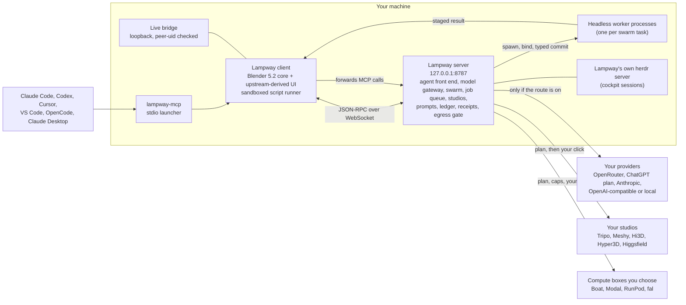

<!-- SPDX-FileCopyrightText: 2026 Lampway contributors -->
<!-- SPDX-License-Identifier: GPL-3.0-or-later -->
<p align="center"></p>

# Lampway

**Your AI. Your subscriptions. Your tools. In the viewport.**

Lampway is an open-source 3D suite on a Blender 5.2 core, with an AI agent inside it and a server **you run yourself**. It does the job a hosted 3D-AI service would do, on the accounts you already pay for, on your machine. Every route that sends data out is off until you switch it on, and every spend waits for your click or stays under a cap you set.

Lampway is an independent open-source project, started from the GPL-licensed Mixar client and built on Blender. Not affiliated with or endorsed by Mixar, Adeveda Enterprises Private Limited or the Blender Foundation. The upstream backend is closed and hosted, so the backend here is new: single-user and loopback by default. See [Licence and attribution](#licence-and-attribution).

> **Status: early, built in the open, one branch per wave.** Linux is the only platform that has been built and run. There are no binaries yet; you build from source. Every feature below says how far it got. "Built" means implemented and tested; it does not mean run live. [`docs/roadmap.md`](docs/roadmap.md) lists what was only exercised against fakes or synthetic data, and what is still planned.

---

## Why

A 3D tool should not be a meter.

- **Your inference.** The agent runs on a model you choose and pay for: an Anthropic API key, an OpenAI-compatible server on your own hardware, OpenRouter, or your ChatGPT plan through OpenAI's own "Sign in with ChatGPT" flow. [`docs/providers.md`](docs/providers.md)
- **Your studios.** Generation services (Tripo, Meshy, Hi3D, Hyper3D, Higgsfield) are used through *your* sign-in or *your* API key. A job that spends credits waits for **your click**, with the price read back from the service. No agent tool can confirm a spend, and the client refuses the confirm while any script is running. [`docs/spend.md`](docs/spend.md)
- **Nothing leaves silently.** Every outbound route (OpenRouter, studios, Higgsfield, fal, cloud boxes, model downloads) is **off until you opt in**. A badge in the sidebar shows when data is leaving, and an egress log records what, to whom and under which retention policy. [`docs/privacy.md`](docs/privacy.md)
- **Proven code first, a model behind it.** Every tool is an algorithm that works without a model (retopology, UV, rig, mesh QA, projection, motion fitting). A model or a studio slots in behind the same interface when it helps.
- **Build the tool, not the output.** The agent produces tools and typed decisions you can re-run and audit, not one-off meshes.
- **Every claim measured.** The reports in [`docs/reports/`](docs/reports) carry test counts, live runs and dollar figures, and say where something was never run live.

---

## Features, as built

Status words: **built** = implemented and covered by tests; **live** = also run end to end in the real app; **partial** = some of it; **in progress** = a lane is working on it now; **planned** = specified, not built.

| | what it is | status | docs |
|---|---|---|---|
| **Agent in the viewport** | Two agent modes per scene tab: Lampway's agent, the pinned Hermes runtime in a pane of Lampway's herdr server (thinking through the provider you chose, reaching the scene through Lampway's tools), or your own agent CLI in its pane. The island in the viewport shows and drives either: questions and permission cards, steer, cancel and reattach, and the conversation survives an app or server restart. Lampway runs no agent loop of its own. | built; Lampway's agent live-tested on the real Hermes engine and herdr in the server suite | [`docs/reports/agent-modes-spec.md`](docs/reports/agent-modes-spec.md) |
| **Your own inference** | Anthropic (API key), any OpenAI-compatible endpoint (Ollama, LM Studio, llama.cpp, vLLM, OpenAI), OpenRouter (session budget ceiling), ChatGPT plan, and opt-in local CLI adapters. A Providers dialog sets the main model, the swarm models and the image and video models. | built; OpenRouter live; ChatGPT plan built to the documented protocol | [`docs/providers.md`](docs/providers.md) |
| **Swarm** | The agent starts parallel workers, each a headless Blender process. A worker's result reaches your scene only through a typed, fenced commit; a failed worker lands nothing. A Parallel Agents panel shows one card per worker. Up to 6 workers per swarm. | live on OpenRouter models; not run on the Claude CLI adapter | [`docs/reports/studios.md`](docs/reports/studios.md) |
| **Online studios, with a confirm gate** | Tripo (through your signed-in studio tab, plus REST), Meshy, Hi3D and Hyper3D (REST, your API key), Higgsfield (MCP, your sign-in). Plan first (settings and price read back), then only your click starts a spend. | built; **never run live** (fakes and recorded fixtures only) | [`docs/providers.md`](docs/providers.md), [`docs/spend.md`](docs/spend.md) |
| **Image and video generation** | OpenRouter image models per purpose (plates, masks, concepts, tiles) and video models with a catalogue, price estimate before submit, per-job and ledger caps, no resubmit. Video presets: bulk, loop, motion transfer, edit, upscale. | live: one 5 s video ($0.05), one image ($0.067) | [`docs/providers.md`](docs/providers.md) |
| **Prompt library** | 27 built-in templates (19 image, 8 video) on one five-part spine, typed variables, per-model adapters, user and project templates that override by id, every run logged with rating, cost and gates. | built | [`docs/reports/prompts.md`](docs/reports/prompts.md) |
| **Job receipts and spend ledger** | A paid job is written to disk before it is sent; a crash leaves "maybe sent", which is never resubmitted. One append-only ledger of runs, gates, ratings and costs. | built | [`docs/spend.md`](docs/spend.md) |
| **Privacy and egress consent** | Every route off by default, one choke point at the HTTP transport, a Privacy panel with a "data leaving" badge, a content-free egress log, per-asset overrides for private content. | built | [`docs/privacy.md`](docs/privacy.md) |
| **Compute wrapper** | One provider-agnostic AXI command line over Boat, Modal, RunPod and fal, with receipts, caps ($1 a job, $5 a day, a click above $0.25), verified teardown and Blender offload (bakes, thumbnails, silhouettes). | built; Boat tested live (about $0.0016); the others on fakes | [`docs/compute.md`](docs/compute.md) |
| **Mesh QA with typed decisions** | Open loops and floating shells drawn per piece; your Red/Green/Yellow strokes become rulings; verdicts are proposed rules first. A proposal never writes a ruling. | live | [`docs/reports/harden.md`](docs/reports/harden.md) |
| **Game-armour pipeline** | Plates, seeds, audits, UV, parts, mesh-paint texturing, bake, PBR, fit, bind, validate and export, as ordered gated steps. | partial: live pieces for mesh-paint and rebuild; waves 2-3 tested on synthetic shapes | [`docs/armour-pipeline.md`](docs/armour-pipeline.md) |
| **Animation from video** | Reference render, clip plan, two-view motion fit, checks and loop export. | built on synthetic data; the tracker provider and the engine leg are open | [`docs/animation-from-video.md`](docs/animation-from-video.md) |
| **Features pass** | Retopology (QuadriFlow, optional AutoRemesher), UV unwrap, layout and rectify, segmentation, auto-rig, image to 3D by visual hull, splat import, scene cleanup, batch export, procedural materials, layered paint, camera shots, dictation. | built; tested on synthetic shapes | [`docs/tools.md`](docs/tools.md) |
| **Connect AI apps (MCP)** | Claude Code, Codex, Cursor, VS Code, OpenCode, Claude Desktop or any stdio client can drive your open scene. The server offers 98 tools; studio tools that spend credits are not offered. | live (earlier build) | [`docs/lampway/connect-ai-apps.md`](docs/lampway/connect-ai-apps.md) |
| **Cockpit** | Your real Claude Code, Codex or OpenCode sessions in Lampway's own isolated herdr server, which survives a Lampway or Blender crash. | built (panel and server); the cockpit window and WezTerm add-on are in progress | [`docs/cockpit.md`](docs/cockpit.md) |
| **Asset Vault** | A local library (SQLite, content-addressed storage, search, ratings, provenance, embeddings). | partial: the library code is built; it is **not wired into the server yet**, and the editor is in progress | [`docs/asset-vault.md`](docs/asset-vault.md) |
| **Hardening** | A sandbox that gates file reads and writes by realpath, a loopback bridge that checks the peer's uid, Host and Origin guards, redacted logs, telemetry off by default. | built | [`docs/reports/harden.md`](docs/reports/harden.md), [`SECURITY.md`](SECURITY.md) |

What is not here: a hosted service, accounts, billing, telemetry by default, or any contact with the upstream project's servers. The client's links, update checker and telemetry endpoint resolve to your server or to this repository.

---

## Quick start (Linux)

You need an Ubuntu 24.04 environment with GCC 14, about 13 GB of disk per build environment, and an hour: a clean build measured **41 minutes on 5 of 16 cores**, an unchanged re-run about a minute. The full walkthrough is [`docs/getting-started.md`](docs/getting-started.md); the build details are [`BUILD-LAMPWAY.md`](BUILD-LAMPWAY.md).

```bash
git clone https://github.com/Keigyoku/lampway.git     # the build script fetches the upstream submodule itself, shallow
cd lampway

# 1. build the app inside the Ubuntu 24.04 box (--plan prints what it would do and touches nothing)
scripts/lampway/build_linux.sh --check-deps
MIXAR_ENV=Prod scripts/lampway/build_linux.sh        # the build variables keep their upstream names for now

# 2. the server (Python 3.12 or newer)
python3 -m venv server/.venv
server/.venv/bin/pip install -r server/requirements-lock.txt
server/.venv/bin/pip install -e server/

# 3. one command: starts the server on 127.0.0.1:8787, starts the app against it, opens a COPY of your file,
#    and stops the server it started when the app exits
scripts/lampway/lampway --env Prod --copy --provider mock path/to/scene.blend
```

Lampway's agent runs on the pinned Hermes engine in a herdr pane: build it with `scripts/lampway/engine_env.py` and herdr with `scripts/lampway/herdr_env.py`, have Node.js 22 or 24, and start the herdr server from the cockpit ([getting started](docs/getting-started.md) section 6); without them a message to it is refused with the fix. `--provider mock` needs no model and no key; it was written for the removed built-in loop and only shows that the agent's pane starts. `--plan` prints every resolved setting without starting anything. `--bridge-port 0` turns the live bridge off. The app keeps its profile under `~/.local/share/lampway` (`LAMPWAY_HOME`).

**Before a real provider works, open its route.** The server starts with every outbound route off, so the first OpenRouter, ChatGPT or Anthropic call is refused with "route is off: switch it on in Privacy". In the app, open the **Lampway** tab in the 3D viewport sidebar, then **Privacy (what leaves this machine)**, and switch on the route you use. [`docs/privacy.md`](docs/privacy.md) has the command-line way.

macOS and Windows: the build scripts are inherited from upstream and have not been run by this project.

Pick a provider (details in [`docs/providers.md`](docs/providers.md)):

```bash
# OpenRouter with a session ceiling (default $3). The key is never an argument and never printed.
scripts/lampway/lampway --env Prod --copy --provider openrouter \
  --openrouter-key-file ~/.config/lampway/openrouter.env --budget 3 --image-backend openrouter scene.blend

# Your ChatGPT plan: open http://127.0.0.1:8787/app/chatgpt, choose "Continue with ChatGPT", approve in the browser,
# then LAMPWAY_PROVIDER=chatgpt_plan. Tokens stay in <state>/chatgpt_auth.json (0600).
# Anthropic API key:   LAMPWAY_PROVIDER=anthropic ANTHROPIC_API_KEY=...
# Local or compatible: LAMPWAY_PROVIDER=openai OPENAI_BASE_URL=http://127.0.0.1:11434/v1 LAMPWAY_OPENAI_MODEL=<model>
```

**Local CLI adapters are off by default** (`LAMPWAY_LOCAL_CLI=1` turns them on). They run the `codex` or `claude` binary you are already logged into, as you, on your machine, and never read their credential files. For Claude that is a grey zone: Anthropic's terms say they do not permit third-party apps to route requests through Free, Pro or Max plan credentials on behalf of their users. Treat the adapter as personal use on your own machine, read the terms yourself, and do not ship it enabled to anyone else.

---

## How it fits together



The server speaks the client's own agent protocol (v3 harness), so the client needed few changes. The Lampway tools are Python the sandbox runs (`mixar.modules.lampway_tools.api`), with each argument passed as one JSON string literal so no argument can change the code. `docs/tools.md` lists every tool.

---

## Documentation

Start at [`docs/README.md`](docs/README.md). The main pages: [getting started](docs/getting-started.md), [providers](docs/providers.md), [privacy](docs/privacy.md), [spend](docs/spend.md), [compute](docs/compute.md), [asset vault](docs/asset-vault.md), [cockpit](docs/cockpit.md), [animation from video](docs/animation-from-video.md), [armour pipeline](docs/armour-pipeline.md), [tools](docs/tools.md) and the [roadmap](docs/roadmap.md).

**Known limits, stated plainly.** The paint module's `procedural_materials` package was withheld upstream; Lampway ships a small replacement and a MatGen path instead. Higgsfield's tool response shapes are read leniently from its spec, not recorded from a live run. The studio REST drivers, fal, Modal and RunPod were only exercised against fake transports. Windows and macOS are unbuilt. The agent avatar and some native strings still carry upstream names; the rebrand is tracked by the brand gates in `tests/lampway`.

---

## Contributing

See [`CONTRIBUTING.md`](CONTRIBUTING.md): the pre-publish gate and how to enable it, lanes and integration, the test commands and the build box.

- Open an issue or a discussion first for anything large: <https://github.com/Keigyoku/lampway/issues>.
- Behaviour changes come with a test you saw fail for the right reason first. Put the RED line in the commit body.
- There is **no CLA**. By contributing you license your work under GPL-3.0-or-later (inbound equals outbound). Keep SPDX headers on new files.
- Security reports go privately; see [`SECURITY.md`](SECURITY.md). Never commit a key, a token, a personal path or a recorded session that contains one.

---

## Licence and attribution

Lampway is free software under **GPL-3.0-or-later**. Per-file licensing is in SPDX headers and [`REUSE.toml`](REUSE.toml); the texts are in [`LICENSES/`](LICENSES/). Third-party code, models and fonts are listed in [`THIRD_PARTY.md`](THIRD_PARTY.md) and [`NOTICE.md`](NOTICE.md).

- Lampway's own code: GPL-3.0-or-later, copyright Lampway contributors.
- Upstream-original code: GPL-3.0-or-later, copyright Adeveda Enterprises Private Limited (kept as the GPL requires).
- Blender-derived files: GPL-2.0-or-later.
- The layered-paint module adapts [ucupaint](https://github.com/ucupumar/ucupaint) by ucupumar, GPL-3.0-or-later.

Lampway is free software under GPL-3.0-or-later. It began as a fork of the Mixar desktop client (github.com/Mixar-AI/mixar-app, copyright Adeveda Enterprises Private Limited, GPL-3.0-or-later), which is itself a custom build of Blender 5.2 (blender.org, GPL-2.0-or-later). Upstream copyright and licence notices are kept as the GPL requires. The texture-paint module builds on ucupaint by ucupumar (GPL-3.0-or-later). Lampway is not affiliated with, endorsed by or supported by Mixar, Mixar Inc, Adeveda Enterprises Private Limited or the Blender Foundation. Blender is a registered trademark of the Blender Foundation in the EU and USA; Mixar and Mixie are trademarks or pending trademarks of Adeveda Enterprises Private Limited. They are named here only to say where this software came from. No upstream artwork ships; the placeholder art is generated by `scripts/dev/lampway_placeholder_art.py` and replaced by the brand art in `scripts/dev/brand_art`.

Thanks to the Blender community for the foundation, to the upstream authors for publishing the client under the GPL, and to ucupumar for the paint system's lineage.
